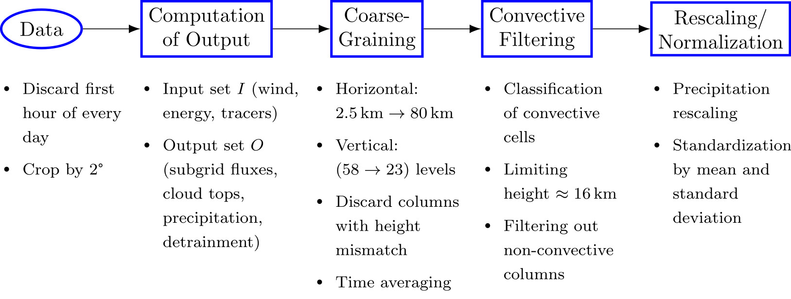

# Preprocessing
In this directory various scripts are saved to preprocess the NARVAL data.
The file `NarvalSlurmPipeline.sh` submits sequential and parallel slurm jobs to call the preprocessing scripts to preprocess the data.
The Preprocessing can be visualized as follows (Figure 2 from the paper):

